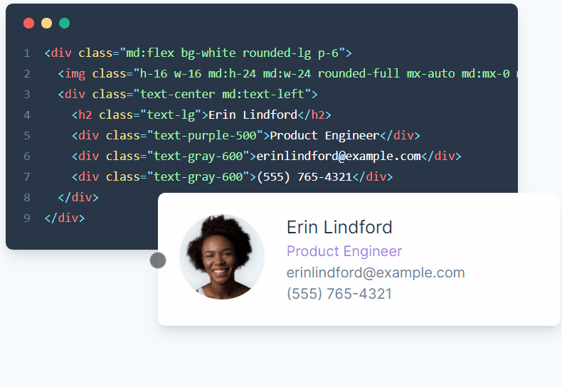

# __Hi there 👋:heart: !__

### __Business Practical!__
## This is my on going Personal Tailwindcss project.

- The project uses tailwind CSS, which is a A utility-first CSS framework for
rapidly building custom designs.
---

----
 Built With
1. HTML
2. tailwindcss
3. VScode
4. Chrome Dev tools

[Live Demo](https://elisha2kyakpo1.github.io/business_practical/.)

🤝 Contributing
Contributions, issues, and feature requests are welcome!

Show your support
Give a ⭐️ if you like this project!
- 👯 I’m looking to collaborate on small and big projects
- 💬 Ask me about SQL,Sass,CSS/HTML
- 📫 How to reach me: [LindedIn](https://www.linkedin.com/in/elisha-kyakopo-009aa3197/)

- 📫 How to reach me:[twitter](@elisha1k)

